# notaio

> **notaio** (Italian: *notary*; IPA /noˈta.jo/, "noh-TAH-yoh")
>
> The notary of the [AgentSandbox](#agentsandbox) platform. It reads what an agent sandbox is
> allowed to do, refuses anything the threat model forbids, and certifies the rest as a signed,
> versioned bundle that every enforcing component checks before it acts.

notaio turns a small, reviewable `SandboxPolicy` into that bundle.
[mediatore](https://github.com/firestoned/mediatore),
[mediatore-guest](https://github.com/firestoned/mediatore/tree/main/crates/mediatore-guest)
and the egress gateway enforce it; none of them ever reads a policy object directly.

[](https://github.com/firestoned/notaio/actions/workflows/build.yaml)
[](https://github.com/firestoned/notaio/actions/workflows/e2e.yaml)
[](https://github.com/firestoned/notaio/actions/workflows/docs.yaml)
[](https://github.com/firestoned/notaio/actions/workflows/codeql.yaml)
[](https://github.com/firestoned/notaio/actions/workflows/sast.yaml)
[](https://scorecard.dev/viewer/?uri=github.com/firestoned/notaio)

[](https://www.rust-lang.org/)
[](https://firestoned.github.io/notaio/)
[](SECURITY.md)
[](#status)
[](https://github.com/firestoned/notaio/issues)
[](https://github.com/firestoned/notaio/commits/main)
[](https://github.com/firestoned/notaio/pulls)

## Status

**v0 scaffold.** The pure logic (registry, lint, compiler, bundle signing and verification) is
implemented and tested. The controller, its RBAC and the GitOps-only admission policy run end to end
on kind in CI (`make kind-e2e`), but nothing has run on a production cluster yet. See
[ROADMAP.md](ROADMAP.md).

Documentation: <https://firestoned.github.io/notaio/>. Security reports: [SECURITY.md](SECURITY.md).

## AgentSandbox

AgentSandbox runs agent-generated code on a person's behalf, with that person's credentials. Its
threat model starts from an uncomfortable assumption: sooner or later the agent **will** be steered
by hostile content, a poisoned README, a crafted web page or a malicious tool result. So no boundary
is allowed to depend on the agent behaving, and each one has to hold on its own:

- **A hypervisor, not a container.** Untrusted code never runs in a Kubernetes cluster. Every
  sandbox is its own VM, with its own vTPM, created outside any cluster. Kubernetes only orchestrates
  ([banlieue ADR-0081](https://github.com/firestoned/banlieue/blob/main/docs/adr/0081-kubernetes-orchestrates-vms-run-agents.md)).
- **Nothing gets in.** Sandboxes accept no inbound connections and ship without sshd. The only way
  out is an outbound, mutually authenticated stream to mediatore, and the jailed agent itself sits
  in an empty network namespace
  ([banlieue ADR-0082](https://github.com/firestoned/banlieue/blob/main/docs/adr/0082-no-inbound-to-sandboxes.md)).
- **The user's token never enters the VM.** The agent gets short-lived tokens scoped to one
  audience, minted only for the VM that attested on that user's claim.
- **Permissions are written down once, and signed.** What a sandbox may reach, which tools it may
  run, how long it may live: that is notaio's job.

```mermaid
flowchart TB
    subgraph git["Git: reviewed changes only"]
        policy["SandboxProfile · SandboxPolicy · KnobGrant"]
    end

    subgraph mgmt["Management cluster: orchestration only"]
        direction LR
        gitops["GitOps reconciler<br/>the only writer,<br/>enforced by admission"]
        notaio["<b>notaio</b><br/>lint, compile, sign"]
        bundle[("signed bundle<br/>DSSE, versioned, expiring")]
        banlieue["banlieue<br/>pools and claims,<br/>one VM per identity"]
        mediatore["mediatore<br/>login, binding,<br/>short-lived tokens"]
        gitops --> notaio --> bundle
    end

    user(["person"])

    subgraph vm["Sandbox VM: outside any cluster, own vTPM, no inbound"]
        direction LR
        agent["agent (jailed)<br/>empty network namespace"]
        guest["mediatore-guest (root)<br/>jail, nftables, settings"]
        agent -- socket --> guest
    end

    gateway["egress gateway<br/>allowlist"]
    world(["allowed destinations"])

    policy --> gitops
    user -- login --> mediatore
    banlieue -- "creates, outside the cluster" --> vm
    guest == "outbound mTLS, the only way out" ==> mediatore
    guest -- "jailed traffic" --> gateway --> world

    bundle -. verified by .-> mediatore
    bundle -. verified by .-> guest
    bundle -. allowlist .-> gateway
```



Solid arrows are the only paths that exist; dotted ones are where the signed bundle is enforced.

The platform is a handful of small projects, each owning one of those boundaries:

| Project | Owns |
| --- | --- |
| [banlieue](https://github.com/firestoned/banlieue) | Kubernetes-native VM API. Keeps warm pools of VMs and hands each one out exactly once, through a claim, to one subject. Knows nothing about agents ([ADR-0055](https://github.com/firestoned/banlieue/blob/main/docs/adr/0055-agentsandbox.md)). |
| [mediatore](https://github.com/firestoned/mediatore) | The trusted go-between. A person's login at the front, an attested VM at the back, bound to each other before anything inside the VM can act for that person. Verifies notaio's bundle and evaluates it at every token it mints. |
| [mediatore-guest](https://github.com/firestoned/mediatore/tree/main/crates/mediatore-guest) | The in-guest agent, root in every sandbox VM. Renders the jail, the nftables ruleset and the agent's settings from the verified bundle, and holds the VM's one connection out. |
| egress gateway | The only place the jailed agent's traffic can go. Enforces the allowlist from the same bundle. |
| **notaio** | What all of the above enforce. Profiles (Fortress, Hardened, Standard, Lab) set every knob in the threat model's register; a policy binds groups to a profile; a time-boxed, approved `KnobGrant` can relax one knob by one step, and never more. |

The contracts between them (the CRD types, the bundle format, its version and expiry rules) live
here. Freezing bundle schema v1 is [ROADMAP M1](ROADMAP.md#m1-make-the-contracts-trustworthy), and
wiring the consumers to it is [M3](ROADMAP.md#m3-integrate-the-consumers).

notaio sits apart from the rest on purpose
([ADR-0001](docs/adr/0001-separate-project.md)). banlieue holds hypervisor credentials, and the
threat model says whoever holds the keys to the VMs must not also sign the policy. mediatore is the
most trusted runtime component, and adding a Kubernetes client and a signing key to it would only
widen it. So a change to what an agent may do is a reviewed change in Git, admitted only through
GitOps, compiled and signed here, and verified by every consumer, which refuses anything older than
the newest bundle it has accepted.

## What it does

```
SandboxProfile (cluster, platform owned)   knob steps for Fortress, Hardened, Standard, Lab
SandboxPolicy  (namespaced)                binds groups to a profile, adds audiences, egress, tools
KnobGrant      (namespaced)                a time-boxed, approved, one-step relaxation of one knob
        |
        v   notaio controller: lint, apply grants, compute ceilings, compile, sign
Signed bundle (DSSE envelope in a ConfigMap) + status: version, digest, maxExposure, conditions
        |
        v   consumed, never edited
mediatore (verify, evaluate at every mint)   mediatore-guest (render jail, nftables, settings)   gateway
```

It is deliberately **not** in [banlieue](https://github.com/firestoned/banlieue) (a provider-agnostic VM API) and **not** in
[mediatore](https://github.com/firestoned/mediatore) (the most trusted runtime component). See
[ADR-0001](docs/adr/0001-separate-project.md).

## Layout

| Path | Purpose |
| --- | --- |
| `crates/sandboxpolicy-types` | Pure data types. No Kubernetes dependency. |
| `crates/sandboxpolicy-api` | The three CRDs, `sandbox.firestoned.io/v1alpha1`. [banlieue](https://github.com/firestoned/banlieue) and tooling depend on this. |
| `crates/sandboxpolicy-bundle` | Bundle format, DSSE signing, verification. **The only crate [mediatore-guest](https://github.com/firestoned/mediatore/tree/main/crates/mediatore-guest) needs.** |
| `crates/sandboxpolicy-core` | Knob register, built-in profiles, lint rules, ceilings, `evaluate`. Pure, no I/O. |
| `crates/notaio` | The controller, and `crdgen` which generates the checked-in manifests. |
| `deploy/` | Raw manifests. `crds/` and `profiles/` are generated, the rest is hand written. |
| `docs/` | Architecture, ADRs, mapping to the threat model, and the [FINOS AI Governance Framework mapping](docs/framework-mapping.md) (generated from `docs/air/`). |

## Develop

```sh
make help        # every target
make test        # unit and integration tests, offline
make lint        # rustfmt and clippy with warnings denied
make manifests   # regenerate deploy/crds and deploy/profiles from the code
make kind-e2e    # deploy to a local kind cluster and run the e2e suites
make docs        # build the documentation site into docs/site/
```

Rust 1.89 or newer. Every dependency is permissive (see `deny.toml`).

## Try the compiler without a cluster

The decision logic is a pure function, so you can exercise it from a test. The fastest way to see it
work is to read `crates/sandboxpolicy-core/tests/evaluate.rs`: each test is a scenario from the
threat model (a grant that jumps two steps, a grant that completes the exfiltration triangle, a
missing approval, an expired grant).

## Licence

Apache-2.0 is set in `Cargo.toml` as an assumption. Confirm it, and add a `LICENSE` file, before the
first public push.
