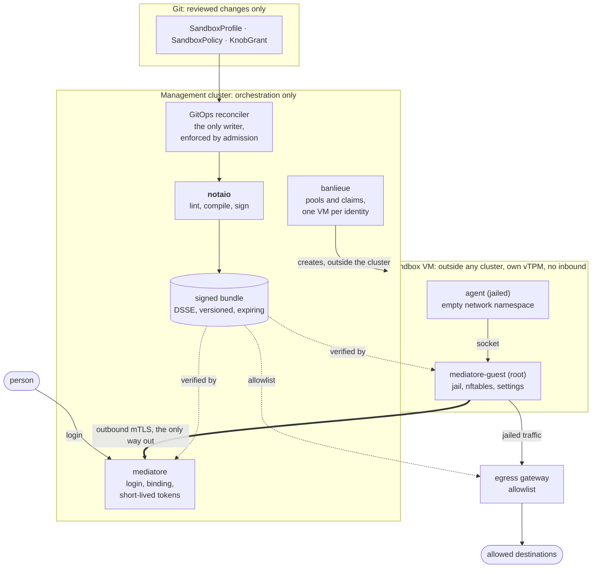
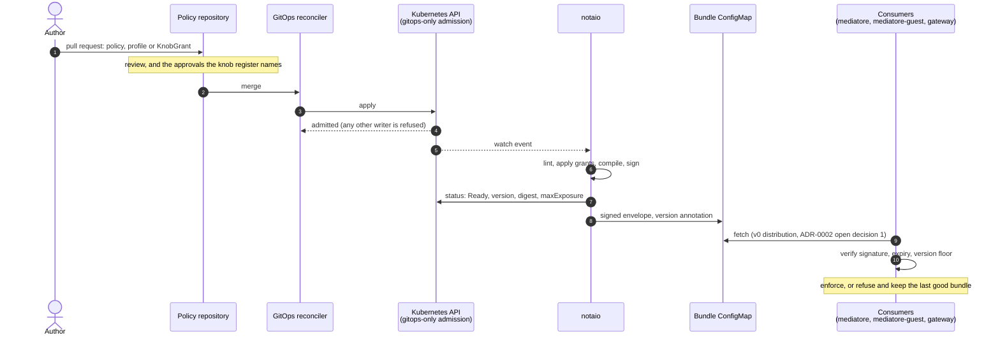
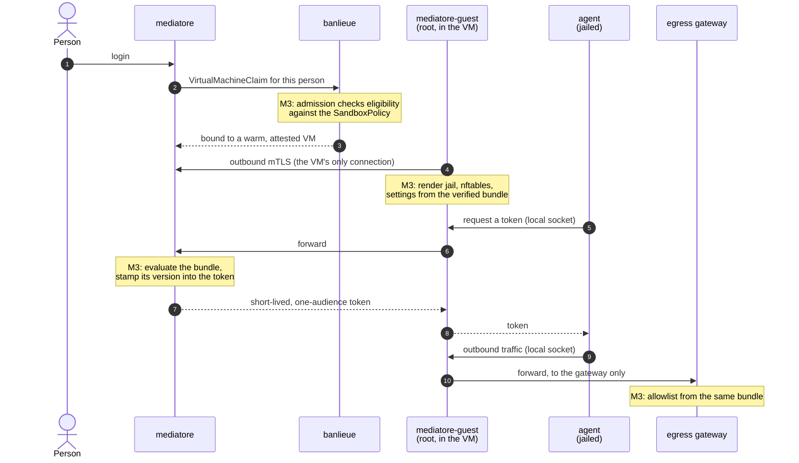

# Architecture

## Purpose

The AgentSandbox threat model says access is added by turning named knobs, each with a locked
default, a prerequisite, an approver and an expiry. This project makes that model executable: it is
where a knob setting is checked, where the exfiltration triangle is ruled out, and where a policy
becomes a signed artifact the rest of the platform can trust.

## Where notaio sits in AgentSandbox

AgentSandbox runs agent-generated code on a person's behalf, with that person's credentials, and
assumes the agent will eventually be steered by hostile content. The platform is therefore split
into small components that each own one boundary, and notaio owns the one that says what a sandbox
may do. It does not run sandboxes, mint tokens or filter traffic. It decides, signs, and leaves
enforcement to the components that sit on each path.

Solid arrows are the only paths that exist. Dotted arrows are where the signed bundle is enforced.
Sandboxes take no inbound connections and have no route to any Kubernetes API server
([banlieue ADR-0081](https://github.com/firestoned/banlieue/blob/main/docs/adr/0081-kubernetes-orchestrates-vms-run-agents.md),
[ADR-0082](https://github.com/firestoned/banlieue/blob/main/docs/adr/0082-no-inbound-to-sandboxes.md)).

### The components

| Component | Runs | Relationship to notaio | Today |
| --- | --- | --- | --- |
| **notaio** | management cluster | The only producer of bundles. Watches the three kinds, writes their status and the bundle, and nothing else. | implemented; e2e on kind |
| Policy repository | Git | Where the three kinds are authored and reviewed. A `KnobGrant`'s approvals reference the reviewed change. | by convention |
| GitOps reconciler | management cluster | The only identity allowed to create, change or delete the three kinds (`deploy/admission/gitops-only.yaml`). notaio itself cannot (`deploy/controller/10-rbac.yaml`). | implemented; `e2e_admission`, `e2e_rbac` |
| [banlieue](https://github.com/firestoned/banlieue) | management cluster | Creates one VM per identity, outside any cluster, and hands it out through a claim. Consumes the CRD types (`sandboxpolicy-api`): its admission checks claim eligibility with these objects as parameters, and the claim records the policy version. No policy logic lives in banlieue. | M3 |
| [mediatore](https://github.com/firestoned/mediatore) | management cluster | Binds a person's login to an attested VM and mints short-lived, one-audience tokens. Verifies the bundle, evaluates it at every mint, stamps the bundle version into the token and refuses a stale one. Never watches policy objects. | M3 |
| [mediatore-guest](https://github.com/firestoned/mediatore/tree/main/crates/mediatore-guest) | root, inside every sandbox VM | Renders the jail, the nftables ruleset and the agent's settings from the verified bundle. Depends on `sandboxpolicy-bundle` only, which has no Kubernetes dependency, so a root process in a hostile VM inherits no cluster client. Never evaluates policy for itself. | M3 |
| Egress gateway | sandbox network edge | The only place the jailed agent's traffic can go. Takes its allowlist from the same bundle. | M3 |

### The contracts

Everything that crosses a component boundary is one of these. Changing one is a cross-project
change, which is why they sit in small crates with their own ADR.

| Contract | Written by | Read by | Defined in | State |
| --- | --- | --- | --- | --- |
| `SandboxProfile`, `SandboxPolicy`, `KnobGrant` (`sandbox.firestoned.io/v1alpha1`) | GitOps reconciler (spec), notaio (status only) | notaio; banlieue admission (M3) | `crates/sandboxpolicy-api`, `deploy/crds/` | v1alpha1 |
| Signed bundle: a DSSE envelope over the compiled content | notaio, and only notaio | mediatore, mediatore-guest, gateway | `crates/sandboxpolicy-bundle`, [ADR-0002](adr/0002-bundle-contract.md) | proposed; schema v1 freeze is M1 |
| Bundle location | notaio | the consumers | v0: ConfigMap `<policy>-bundle` beside the policy, with version and digest annotations | ADR-0002 open decision 1 |
| Trusted public key | the signing key's custodian | every consumer | distributed out of band | ADR-0002 open decision 2 |
| Policy status: `Ready`, version, digest, `maxExposure`, active grants | notaio | operators, reviewers, dashboards | `crates/sandboxpolicy-api` | implemented |

### The life of a change

The bundle version moves only when the compiled content changes, so a consumer can treat "newer
version" as "different rules". Its `notAfter` is never later than the earliest active grant expiry,
so a relaxation ends on its own with nothing to revoke. A tightening, or a deleted policy, takes
effect only as fast as the bundle lifetime for a consumer that does not re-fetch (ADR-0002 open
decision 3).

### The life of a sandbox

How the pieces meet at runtime once the consumers are wired up. Steps marked M3 are the planned
consumer integration (`ROADMAP.md`); the rest exists in banlieue and mediatore today.

### Who trusts what

- **Consumers trust the key, not the messenger.** A consumer accepts a bundle because it verifies
  against a trusted public key, never because of where it was read from. Anything that can write the
  bundle ConfigMap can withhold a bundle or replay an older one. It cannot loosen a sandbox: a forged
  bundle fails the signature, and an older one fails the version floor and expiry.
- **notaio trusts only the API server.** It takes no inbound connection, holds no hypervisor
  credentials, and no agent traffic reaches it. Its RBAC is read on the three kinds, status writes,
  and bundle writes in named namespaces.
- **Duties are split on purpose.** banlieue holds the keys to the VMs, mediatore holds the power to
  mint tokens, and notaio holds the power to sign policy. The threat model requires that whoever
  holds the keys to the VMs does not also sign the policy (T8.2, scenario S6), and in production the
  signing key must sit in a KMS, HSM or TPM that cluster administrators cannot use.
- **The guest decides nothing.** mediatore-guest renders what the bundle says. It never evaluates
  policy and never talks to a Kubernetes API server, so a compromised guest can at worst break its
  own sandbox, which the controls outside the guest (host and gateway) still contain.

## The three kinds

**SandboxProfile** (cluster scoped). A named set of knob steps, `R0` to `R3`, plus a `dataScope`.
`dataScope: LabOnly` records that the profile holds no sensitive data, which is what lets Lab combine
untrusted content with an open outbound channel. Missing knobs mean `R0`. The four built-in profiles
are in `deploy/profiles/builtin.yaml`, generated from `sandboxpolicy-core/src/builtin.rs`.

**SandboxPolicy** (namespaced). Names a profile and adds the concrete audiences (with `Read` or
`Write` access and token TTL), egress allowlist entries, tools pinned by manifest digest, and
optionally lease and budget limits. It can only narrow what its profile allows.

**KnobGrant** (namespaced). A relaxation of one knob for one policy. It must be exactly one step
above the profile, carry an owner, a reason, an expiry inside the cap for its step (R1 90 days, R2 30,
R3 7) and an approval from every role the register names for that knob, each with a reference to the
reviewed change.

## Evaluation

`sandboxpolicy_core::evaluate` is a pure function of the policy, its profile, its grants and `now`.

1. The profile must exist and lint clean (L001 to L004). Otherwise nothing compiles.
2. Grants are applied in name order. Each is checked alone (L011 to L013), then the knob set with the
   grant applied is linted again, so a grant that would complete the exfiltration triangle is
   rejected without disturbing the others. Expired grants are reported and ignored.
3. The policy is linted against the effective knobs (L005 to L010).
4. The content is compiled with every list sorted, digested, and versioned: the version moves only
   when the digest moves.
5. Bundle validity is `now + lifetime`, clamped to the earliest active grant expiry, so a relaxation
   lapses on its own with no revocation mechanism.
6. `status.maxExposure` records what a fully compromised sandbox could reach (objective O3).

The lint rules and their codes are documented at the top of
`crates/sandboxpolicy-core/src/lint.rs`.

## The controller

Two reconcilers in one process. The profile reconciler lints and records a digest. The policy
reconciler gathers the profile and grants, calls `evaluate`, updates grant statuses, signs and
publishes the bundle to a ConfigMap named `<policy>-bundle` in the policy's namespace, and patches
status.

- **Idempotent.** It writes only when something other than the refresh timestamp changed, so its own
  status writes do not cause a reconcile loop.
- **Fails closed.** No profile, an invalid profile or an invalid policy means no new bundle. With no
  signing key configured it validates and reports `Ready=False, NoSigner` and publishes nothing.
  Unsigned bundles are never published.
- **Monotonic version.** The previous version is the higher of the status and the published
  ConfigMap annotation, so losing status cannot reset it.
- **Least privilege.** Read on the three kinds, `patch` on their status, `get/create/patch` on
  ConfigMaps in named namespaces only. It cannot create, edit or delete a policy object, and it holds
  no hypervisor credentials. It takes no inbound connections.

## The bundle

Defined in `sandboxpolicy-bundle`, described in [ADR-0002](adr/0002-bundle-contract.md). A consumer
verifies the DSSE signature, the payload type, the schema, the content digest, the validity window
and that the version is not below the highest it has accepted. Every failure is a refusal.

## What this project does not do

- It does not evaluate policy at mint time. Mediatore does, using the bundle.
- It does not create VMs or hold hypervisor credentials. Banlieue does.
- It does not deliver instructions to agents (`AgentTask`). That is a separate controller, still
  proposed in the threat model's ADR-0002.
- It does not enforce lease, budget, egress or tool limits. It compiles them, and the consumers
  enforce them.
- It does not check profile eligibility by group (K7.2). That is banlieue admission, using these
  objects as parameters.

## Known gaps in v0

- The controller, the admission policy and the deployment manifests have run on kind, through the
  e2e suites (`make kind-e2e`), but not yet on a k0s test cluster (ROADMAP M1).
- The ConfigMap is a v0 distribution mechanism. Whether consumers should read it from the Kubernetes
  API at all is open decision 1 in ADR-0002.
- The development signer keeps a key in a Secret. The threat model requires the signing key not to be
  held by cluster administrators (T8.2). A KMS, HSM or TPM backed signer is open decision 2.
- A policy that becomes invalid leaves the previous bundle in place until it expires. The bundle
  lifetime is therefore the upper bound on how long a tightening takes to land. Faster tightening is
  open decision 3.
- K5.2 and K5.3 "apply to lab audiences only" for Lab cannot be enforced without a classification of
  audiences. `dataScope` covers the triangle, not this.
- K2.4 (resource limits) is not checked: the model does not define the medium and large sizes.
