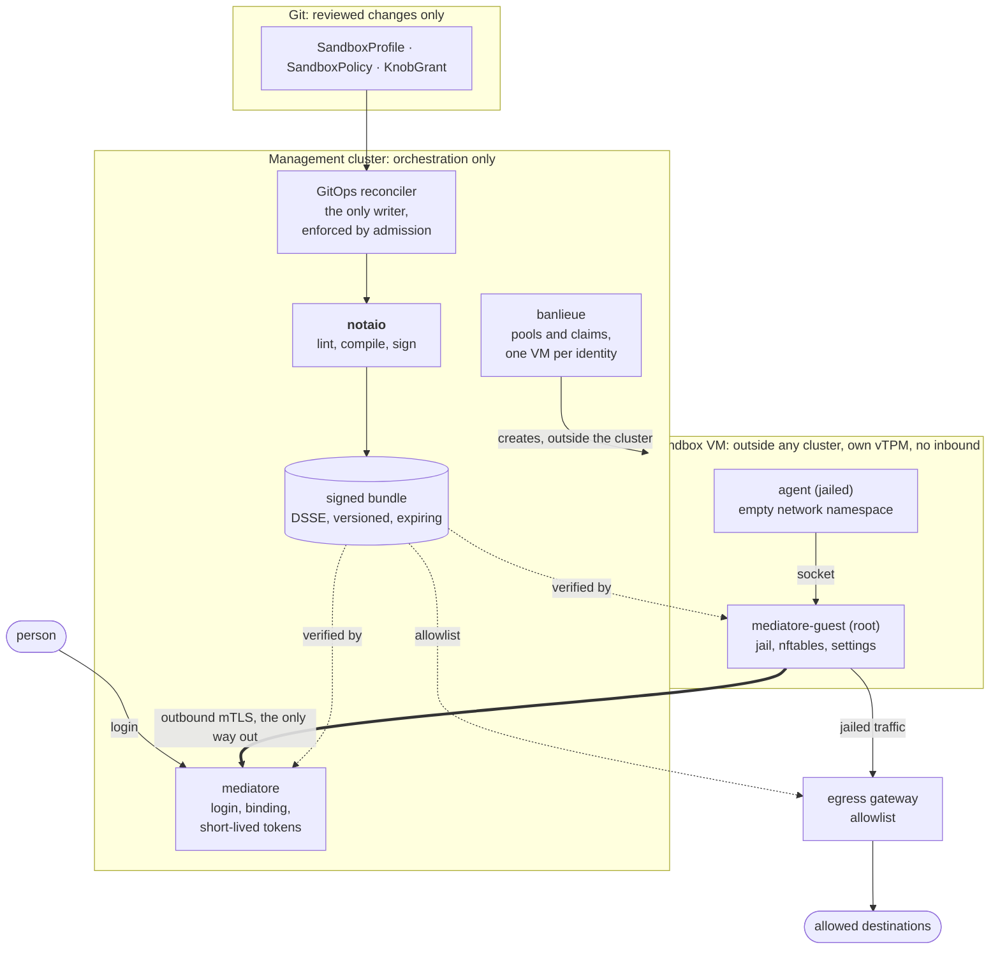
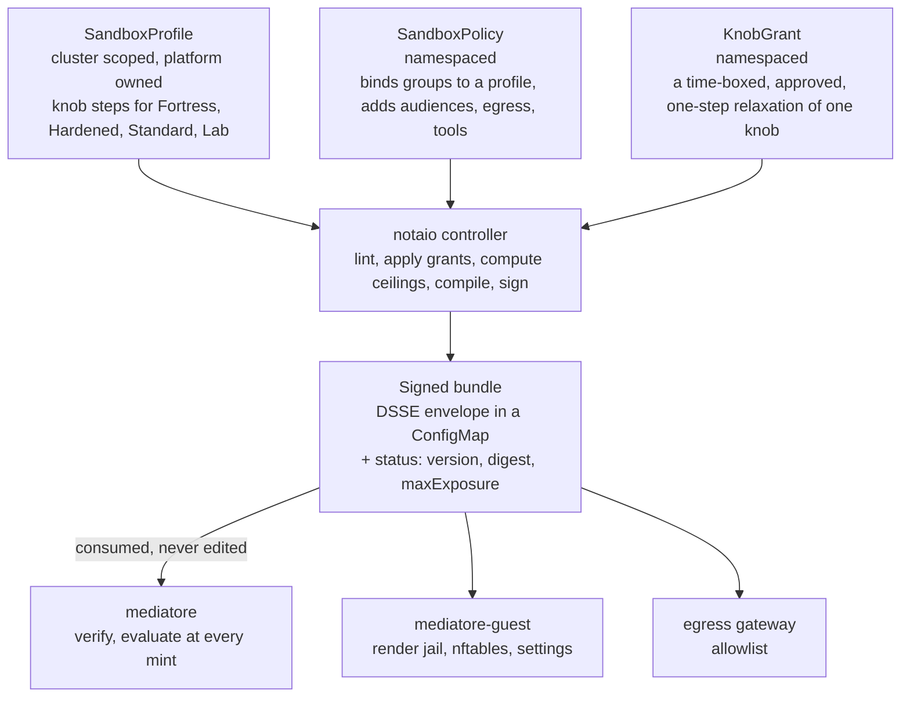

# notaio

**The notary of the AgentSandbox platform** (Italian *notaio*, "noh-TAH-yoh"). notaio turns a small,
reviewable `SandboxPolicy` into a signed, versioned bundle that
[mediatore](https://github.com/firestoned/mediatore),
[mediatore-guest](https://github.com/firestoned/mediatore/tree/main/crates/mediatore-guest)
and the egress gateway enforce, and it refuses any policy that breaks the threat model's rules.

AgentSandbox runs agent-generated code on a person's behalf. It assumes the agent will eventually be
steered by hostile content, so every boundary holds on its own: each sandbox is its own VM from
[banlieue](https://github.com/firestoned/banlieue), outside any cluster; nothing connects in; the user's token never enters the VM; and
what the sandbox may do is written down once, here, and signed.

Solid arrows are the only paths that exist; dotted ones are where the signed bundle is enforced.

!!! warning "Status: v0, in development"
    The pure logic (knob register, lint rules, compiler, bundle signing and verification) is
    implemented and tested. The controller, its RBAC and the GitOps-only admission policy run on kind
    in CI. Nothing has run on a production cluster yet. See the [Roadmap](roadmap.md).

## What it does

It is deliberately **not** in [banlieue](https://github.com/firestoned/banlieue) (a provider-agnostic VM API) and **not** in
[mediatore](https://github.com/firestoned/mediatore) (the most trusted runtime component). See [ADR-0001](adr/0001-separate-project.md).

## Where to read next

| If you want to know | Read |
| --- | --- |
| How notaio, banlieue, mediatore, mediatore-guest and the gateway relate, the contracts between them, and who trusts what | [Where notaio sits in AgentSandbox](architecture.md#where-notaio-sits-in-agentsandbox) |
| How the three kinds, evaluation and the controller work | [Architecture](architecture.md) |
| Which threat model items this enforces, and which it does not | [Threat Model Mapping](security/threat-model-mapping.md) |
| What a consumer can trust in a bundle | [ADR-0002: Bundle contract](adr/0002-bundle-contract.md) |
| What the built-in profiles allow | [Built-in Profiles](reference/profiles.md) |
| How to build, test and run the e2e | [Local Development](developer/index.md) |
| How to report a vulnerability | [Security](security/index.md) |

## Crates

| Crate | Purpose |
| --- | --- |
| `sandboxpolicy-types` | Pure data types. No Kubernetes dependency. |
| `sandboxpolicy-api` | The three CRDs, `sandbox.firestoned.io/v1alpha1`. |
| `sandboxpolicy-bundle` | Bundle format, DSSE signing, verification. The only crate mediatore-guest needs. |
| `sandboxpolicy-core` | Knob register, built-in profiles, lint rules, ceilings, `evaluate`. Pure, no I/O. |
| `notaio` | The controller, and `crdgen`, which generates the checked-in manifests. |
